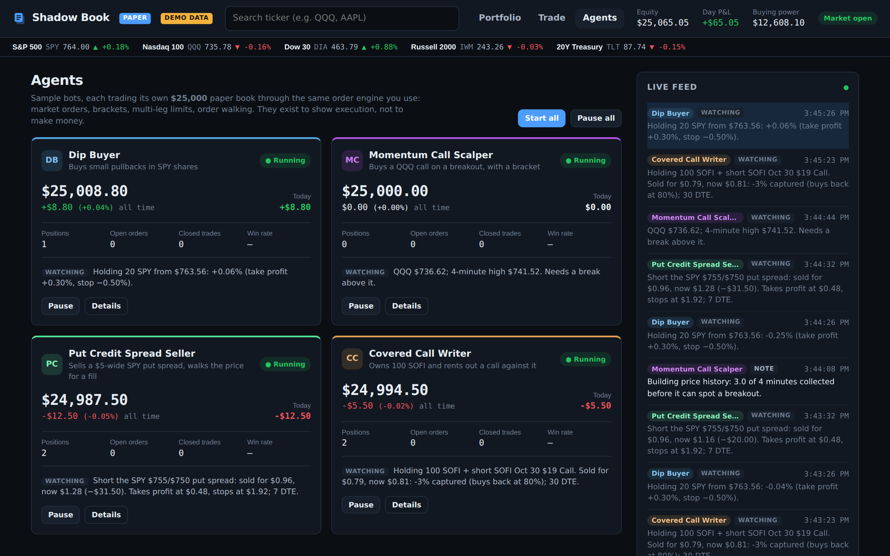
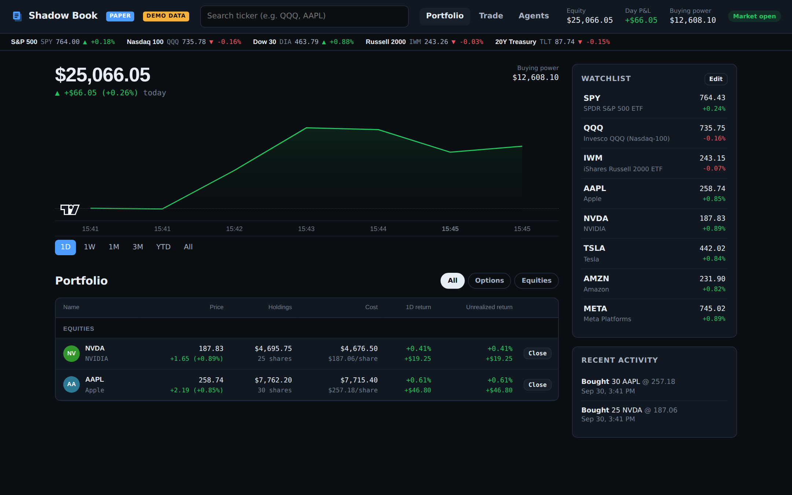

# Shadow Book

**Paper trading for the Public.com API.** Live quotes from Public, simulated orders and fills on
your own computer. Trade stocks and options (including multi-leg spreads, brackets and stops) with
a $25,000 practice account, or watch sample agents trade their own paper books.



> **Unofficial.** Built by an independent developer on Public's public API. Not affiliated with or
> endorsed by Public.com. Your API key is only used to **read** market data. No order is ever sent
> to Public, and no real money is involved.

---

## Quickstart

Needs **Python 3.11+**.

```bash
git clone https://github.com/VincentDelisi/paper-public.git
cd paper-public
python -m venv venv
```

Activate the environment:

```bash
venv\Scripts\activate          # Windows (PowerShell)
source venv/bin/activate       # macOS / Linux
```

Install and try it with synthetic prices (no API key needed):

```bash
pip install -r requirements.txt
python -m paper_public.server --demo
```

Your browser opens **http://127.0.0.1:8000**. Open **Agents** and click **Start all** to watch the
sample bots trade.

### Use live Public data

1. You need a Public.com brokerage account. Generate an API secret key from your Public
   account settings.
2. Copy `.env.example` to `.env` and paste your secret after `PUBLIC_API_KEY=`.
3. Run without `--demo`:

```bash
python -m paper_public.server
```

`.env` is in `.gitignore`, so your key never gets committed. The app only listens on 127.0.0.1:
nothing on your network or the internet can reach it.

---

## What's inside



**Trading**
- Search any ticker, TradingView chart, options chain with IV and Greeks (Black-Scholes from the live bid/ask)
- Order types: market, limit, stop, stop-limit, and brackets (take-profit + stop-loss, one cancels the other)
- Long and short: buy/sell to open or close, short stock, sell options to open
- Strategy builder with 14 strategies (verticals, straddles, strangles, covered calls, cash-secured
  puts and more): pick strikes, see max profit/loss, breakevens and the payoff chart, send as one order

**Account**
- Portfolio home: account value chart, positions grouped by strategy with one-click close,
  watchlist, market strip, recent activity
- Analytics: equity curve, win rate, profit factor, drawdown, P&L by ticker
- Reset to any starting balance

**Agents** (see below)

## How fills work (conservative on purpose)

- Market buys fill at the **ask**, market sells at the **bid**.
- Limit orders rest until the live quote reaches your price.
- Multi-leg orders (2–4 legs) fill all-or-none at a net debit/credit limit.
- Quotes older than a few seconds never fill an order.
- Options use the 100x multiplier; expired contracts settle to intrinsic value in cash.
- Buying power is risk-based: cash-secured puts reserve strike x 100, credit spreads reserve the
  width, covered calls need nothing extra, short stock reserves 150%, naked calls are stress-tested
  at a 50% move up.
- DAY orders expire at 4:00 PM ET. Pattern day trading limits are off by default (FINRA removed the
  PDT rule in June 2026); turn them back on with `PaperBroker(enforce_pdt=True)`.

Simplifications: orders fill in full (displayed size is ignored), exchange holidays aren't modeled,
and options settle in cash rather than shares.

## Agents

Four sample bots, each trading its **own $25,000 paper book**, separate from yours and from each
other. They're there to show the execution engine working, not strategies with an edge.

| Agent | What it does | What it shows off |
|---|---|---|
| **Dip Buyer** | Buys 20 SPY when SPY is 0.4% below the day's high; exits at +0.3% / −0.5% | Market orders, exits |
| **Momentum Call Scalper** | Buys an at-the-money QQQ call on a break of the 10-minute high | Bracket orders (TP +25%, SL −20%) |
| **Put Credit Spread Seller** | Sells a $5-wide SPY put spread near 0.25 delta, 5–10 days out | Multi-leg limit at the mid, walked toward the bid |
| **Covered Call Writer** | Holds 100 SOFI and sells a ~0.30 delta call, buys it back at 80% profit | Stock + option as one order, rolling |

Every decision is logged in plain English ("SPY $769.40 is 0.46% below today's high... buying 20
shares at market"), and a live feed shows all agents together. They start **paused** each time the
server starts. Pausing stops new decisions; open positions and bracket orders stay in place.
In demo mode their time-of-day rules are skipped so they trade at any hour.

### Build your own agent

```python
from paper_public.agents import Agent

class MyAgent(Agent):
    id = "my-agent"
    name = "My Agent"
    tagline = "Buys 10 QQQ when it's up on the day"
    rules = ["One buy per day"]
    symbols = ["QQQ"]
    interval = 10          # seconds between decisions

    def tick(self, ctx):
        q = ctx.quote("QQQ")
        if q is None or ctx.position("QQQ") or ctx.day_state().get("done"):
            return
        if q.previous_close and q.last > q.previous_close:
            ctx.log(f"QQQ {q.last:.2f} is green on the day. Buying 10.", "signal")
            ctx.broker.place_order("QQQ", "BUY", 10)
            ctx.day_state()["done"] = True
```

Add it to `default_agents()` in `paper_public/agents/demos.py` and it gets its own card, book and
log. The context gives you `quote`, `price`, `expirations`, `chain` (with IV and Greeks),
`position`, `positions`, `open_orders`, `log` and persistent `state`.

## Use it from Python

`PaperBroker` has the same shape as a broker call, so a strategy written against it can later move
to live trading by swapping the broker object.

```python
from paper_public import PaperBroker, PublicMarketData

broker = PaperBroker(PublicMarketData(), starting_cash=25_000, daily_loss_limit=500)
broker.place_order("QQQ", "BUY", 10)                                   # market
broker.place_order("QQQ", "BUY", 10, "LIMIT", 739.50)                  # limit
broker.place_order("QQQ", "BUY", 10, take_profit=750, stop_loss=730)   # bracket
broker.place_multileg([                                                # put credit spread
    {"symbol": "SPY261009P00750000", "side": "SELL", "ratio": 1},
    {"symbol": "SPY261009P00745000", "side": "BUY", "ratio": 1},
], quantity=1, order_type="LIMIT", net_price=-1.20)                    # negative = credit
broker.process()      # call every few seconds: fills resting orders, triggers stops, settles expirations
print(broker.account(), broker.positions())
```

## Command line

```bash
python -m paper_public account
python -m paper_public quote QQQ
python -m paper_public buy QQQ 10
python -m paper_public buy QQQ261002C00740000 1 --limit 3.40
python -m paper_public positions
python -m paper_public reset --cash 25000
```

## Rate limits

Every quote request goes through one cache that batches all the symbols the app needs into a single
call, reuses quotes for a few seconds, and backs off (5s up to 60s) on timeouts or HTTP 429.
One browser tab uses roughly 15–25 calls a minute.

## Tests

```bash
python -m pytest
```

## License

Apache 2.0. See [LICENSE](LICENSE).
